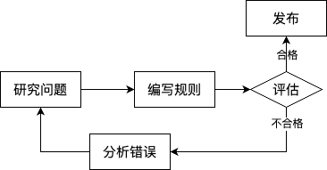
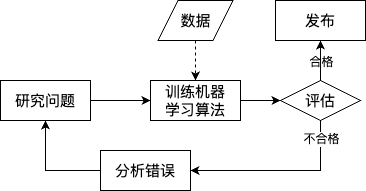
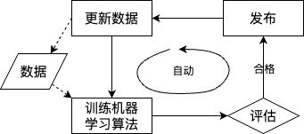

## 1. 什么是机器学习

`机器学习`（`Machine Learning`，`ML`）是一个研究领域，让计算机无需进行明确编程，就具备从数据学习的能力；

一个计算机程序利用经验 E 来学习任务 T，性能是 P，如果针对任务 T 的性能 P 随着经验 E 不断增长，则称为`机器学习`；

`垃圾邮件过滤器`，根据垃圾邮件（用户标记为垃圾）和普通邮件学习标记垃圾邮件；任务 T 就是标记新邮件是否是垃圾邮件，经验 E 就是训练数据，性能 P 需要定义（如准确率：正确分类的邮件比例）；

- `训练集`，系统用来进行学习的样例；
- `训练实例`（`样本`），每一个训练样例；

## 2. 引入机器学习

**垃圾邮件过滤器（传统规则系统）**

<!--  -->

<!-- <div align=center>
    <br/>
    <p><em>计算机根据</em></p>
</div><br/> -->

- `研究问题`：看垃圾邮件一般是什么样子；比如垃圾邮件会频繁出现一些`固定模式`的词或短语（4U、credit card、free、amazing 等）；
- `编写规则`：为每个模式各写一个检测算法，程序在邮件中匹配到一个模式（规律），就将之标记为垃圾邮件；
- `评估` & `分析错误`：测试程序匹配正确性，重复迭代，直到匹配效果足够好；

传统规则系统应对这类需要大量人工微调或大量规则的问题，`很难维护`大量复杂的规则；



ML 技术的垃圾邮件过滤器会自动学习词和短语（`预测因素`），通过与非垃圾邮件比较，检测垃圾邮件中反复出现的词语模式；更易维护，也更精确；



- `更新数据`：用户手动标记垃圾邮件，此时 ML 算法会自动完成垃圾邮件标记，无须人工干预；

- `数据挖掘`，在训练了足够多的样本后，就可以列出模型的特征，这有时可能发现不引人注意的关联或新趋势，有助于更好的理解问题；这种使用机器学习方法挖掘大量数据来发现不明显规律的方式，就是数据挖掘；

**ML 适用场景**

- 有解决方案，但需要大量人工微调或准信大量规则的问题，机器学习通常可以简化代码，相比传统方法有更好的性能（如`垃圾邮件过滤器`）；
- 传统方法难以解决的复杂问题，最好的 ML 自我学习算法也许可以找到解决方案（如`语言识别`）；
- 环境有波动的问题，ML 算法可以适应新数据；
- 帮助人类洞察复杂问题和大量数量（`数据挖掘`）；

## 3. 应用场景

- `图像分类`：使用`卷积神经网络`（`CNN`）分析生产线产品图像，对产品进行自动分类；
- `语义分割`：通过脑部扫描图像，使用 `CNN` 给图像每个像素分类，以确认肿瘤的确切位置和形状；
- `文本分类`：使用`循环神经网络`（`RNN`）、`CNN`、`Transformer` 等 `自然语言处理`（`NLP`）工具进行新闻自动分类：
- `文本分类`：使用`自然语言处理`（`NLP`）工具自动标识论坛中的恶评；
- `文本总结`：使用`自然语言处理`（`NLP`）工具自动对长文章做总结；
- `自然语言理解`（`NLU`）& `问答模块`：使用`自然语言处理`（`NLP`）工具创建聊天机器人或个人助理；
- `回归问题`：使用`回归模型`，如`线性回归`、`多项式回归`、`SVM 回归`、`随机森林回归`、`人工神经网络`等，或通过`过去性能指标`使用如 `RNN`、`CNN`、`Transformer` 等，预测公司下一年的收入；
- `语言识别`：使用 RNN、CNN、Transformer 等处理音频采样，实现对语言命令做出反应；
- `异常检测`：检测性用卡欺诈；
- `聚类问题`：基于客户的购买记录对客户进行分类，对不同类别的客户设计不同的市场策略；
- `数据可视化`：通过降维技术，使用图表展示复杂的高维数据集；
- `推荐系统`：使用人工神经网络，基于以前的购买记录给客户推荐可能感兴趣的产品；
- `强化学习`（`RL`）：通过奖惩机制训练代理，为游戏建造智能机器人；

## 4. 机器学习分类

| 分类方式             | 类别                                               |
| -------------------- | -------------------------------------------------- |
| 是否在人类监督下     | `监督学习`、`无监督学习`、`半监督学习`、`强化学习` |
| 是否动态进行增量学习 | `在线学习`、`批量学习`                             |
| 泛化方式             | `基于实例的学习`、`基于模型的学习`                 |

### 4.1. 有无人类监督

1. 有监督学习

通过经标记的数据（`标签`）进行训练的学习任务；

- `标签`，在学习中，提供给算法的`包含解决方案`的训练集；
- `属性`，一种数据类型，反映事件或对象在某方面的表现或性质的事项；
- `特征`，通常指一个属性加上其值；也可指代属性；
- `分类任务`，典型的有监督学习任务，通过大量包含类别信息的样本进行训练，学习如何对新样本进行分类；预测结果为离散值；
- `回归任务`，典型的有监督学习任务，通过大量包含标签的样本进行训练，学习如何给新的样本预测一个目标数值；预测结果为连续值；

**重要的监督学习算法**

- `k-近邻算法`
- `线性回归`
- `逻辑回归`
- `支持向量机（SVM）`
- `决策树和随机森林`
- `神经网络`

2. 无监督学习

通过`未经标记`的数据进行训练的学习任务；

- `聚类`，将通常不拥有标记信息的训练集的样本分为若干组，每个组称为一个“簇”(cluster)，对应一些潜在的概念划分；
- `可视化`，将大量复杂的未经标记的数据绘制成 2D 或 3D 的数据表示，保留尽可能多的结构，并识别出一些未知的模式；
- `降维`，在不丢失太多信息的前提下简化数据，如将多个相关特征合并为一个（`特征提取`：如将汽车的里程和使用年限合并成一个磨损度的特征）；
- `异常检测`，用正常的实例进行训练，然后判断新势力是正常还是异常；
- `关联规则学习`，挖掘大量数据，发现属性之间的联系；

可以通过`降维`减少训练数据的维度，在将之提供给另一个 ML 算法（比如监督学习算法），这样可以缩小运行所需空间，并提升执行性能；

**重要的无监督学习算法**

- `聚类算法`
- `k-均值算法`
- `DBSCAN`
- `分层聚类`
- `异常检测和新颖性检测`
- `单类 SVM`
- `孤立森林`
- `可视化和降维`
- `主成分分析（PCA）`
- `局部线性嵌入（LLE）`
- `t-分布随机近邻嵌入（t-SNE）`
- `关联规则学习`
- `Apriori`
- `Eclat`

3. 半监督学习

处理部分已标记数据的算法，被称为半监督学习算法；

- `照片托管服务`，先自动识别照片中出现的人物 A、B、C，然后由认为告诉系统 A、B、C 是谁；

**半监督学习算法**

- `深度信念网络（DBN）`，基于一种互相堆叠的无监督组件（受限玻尔兹曼机（RBM），无监督），使用监督学习技术对整个系统进行微调；

4. 强化学习

通过观察环境，做出选择，执行动作，并获得正负回报（奖惩），从而学习什么是最好的策略；如 DeepMind 的 AlphaGo，机器人行走等；

### 4.2. 是否增量学习

1. 批量学习

使用所有可用数据进行离线训练，得到系统，然后将停止学习的系统投入生产环境，将所学到的应用出来；

新数据的学习需要在完整数据集（新旧数据）的基础上重新训练系统，然后停用旧系统，用新系统取代；

无法增量学习，需要的大量时间和计算资源（CPU、内存、磁盘空间、磁盘 I/O、网络 I/O 等）；

2. 在线学习

循序渐进的给系统提供训练数据，逐步积累学习成果；模型经过训练并投入生产环境，然后根据飞速写入的最新数据继续不断学习；

新的数据一旦经过在线学习系统的学习，就可以丢弃（节省了大量资源，除非需要留备`重新学习`）；

适用于资源有限的系统，或者超大数据集的学习任务（`核外学习`，将数据集分成小批量数据用于在线学习系统的持续训练）；

在线学习在接收不良数据后，系统的性能会逐渐下降；这需要密切监控系统，一旦`性能下降`，及时`中断学习`（甚至恢复之前的工作状态）；需要监控输入数据，检测出异常数据（`异常检测算法`）；

- `学习率`，在线学习系统的一个参数，代表适应新数据的速度；学习率高，则很快适应新数据，但会很快忘记旧数据；学习率低，则系统存在较高的惰性，学习会更缓慢，但也会对新数据的`噪声`和`非典型数据点`（`离群值`）的序列更不敏感；

### 4.3. 泛化方式

- `泛化`，系统通过给定的训练示例，在它未见过的示例上进行预测的能力（ML 的真正目的是要在新的对象实例上表现出色，而非局限在训练集上）；

1. 基于实例学习

系统会记住训练实例（`死记硬背`），通过使用`相识度`度量来比较新实例和已学习的实例，从而泛化新实例；

**例：k-近邻回归**

通过找到与新实例最相近的若干训练实例，将这些训练实例的`均值`作为新实例的预测结果；

2. 基于模型学习

泛化出适配训练实例的模型（可以描述实例分布的代数表示？），使用该模型进行新实例的预测；

- `模型`，数据中学得的结果，对应了数据中某种潜在的规律，亦称假设，规律本身称作“真相”，学习过程就是为了找出或逼近真相（模型表示全局性结果，模式表示局部性结果，比如一条规则）；
- `模型训练`，运行一种寻找模型参数的算法，通过训练样本，找出最符合训练数据的模型参数，使成本函数最小；
- `模型选择`，包括选择模型的类型和完全指定它的架构（输入输出结构）；
- `效用函数`，衡量模型多好的函数；
- `成本函数`，衡量模型多差的函数；

**例：[线性回归](https://github.com/ageron/handson-ml2/blob/master/01_the_machine_learning_landscape.ipynb)**

```python
import matplotlib.pyplot as plt
import numpy as np
import pandas as pd
import sklearn.linear_model
# Load the data
oecd_bli = pd.read_csv("oecd_bli_2015.csv", thousands=',')
gdp_per_capita = pd.read_csv("gdp_per_capita.csv",thousands=',',delimiter='\t',
                            encoding='latin1', na_values="n/a")
# Prepare the data
country_stats = prepare_country_stats(oecd_bli, gdp_per_capita)
X = np.c_[country_stats["GDP per capita"]]
y = np.c_[country_stats["Life satisfaction"]]
# Visualize the data
country_stats.plot(kind='scatter', x="GDP per capita", y='Life satisfaction')
plt.show()

# Select a linear model
model = sklearn.linear_model.LinearRegression()
# Train the model
model.fit(X, y)
# Make a prediction for Cyprus
X_new = [[22587]]  # Cyprus's GDP per capita
print(model.predict(X_new)) # outputs [[ 5.96242338]]

# # Select a 3-Nearest Neighbors regression model
# import sklearn.neighbors
# model1 = sklearn.neighbors.KNeighborsRegressor(n_neighbors=3)
```

通过模型训练找到最拟合训练数据的模型参数，然后直接通过得到的模型计算新实例的预测结果；

`研究数据` -> `选择模型` -> `训练模型` -> `模型推理`；

## 5. 主要挑战

在 ML 过程中最主要的任务是选择学习算法、使用某些数据进行训练；因此最可能出现的问题就是`坏算法`和`坏数据`;

1. 数据不足

- `数据的不合理有效性`，给定足够数据，不同的 ML 算法在自然语言歧义消除上表现几乎一致；

把钱和时间花在算法的开发上，还是语料库的建设上是需要权衡的问题；对于复杂的问题，数据比算法更重要；

2. 训练数据不具代表性

对于将要泛化的新实例，训练数据必须有非常强的代表性；

- `采样偏差`，若样本集太小，会出现采样噪声；即使样本集够大，若采样方式欠妥，也可能拿到非代表性数据集；

3. 低质量数据

训练集是错误、异常值或噪声，系统将难以检测底层模式，学习效果不可能好；

- 若某些实例明显异常，可以直接丢弃、或尝试手动修复；
- 若某些实例缺少部分特征，可以整体忽略这些特征、忽略这部分缺失的实例、将缺失部分补全（中位数等）、训练一个带这个特征的模型，再训练一个不带这个特征的模型，进行比较；

4. 无关特征

只有训练数据里包含足够多的相关特征，较少的无关特征，系统才能完成学习；

- `特征工程`，提取一组好的用来训练的特征集；
  - `特征选择`，从现有特征中选择最有用的特征进行训练；
  - `特征提取`，将现有特征进行整合，产生更有用的特征（如降维）；
  - `创建新特征`，收集新数据等；

5. 过拟合

把训练样本自身的一些特点当作了所有潜在样本都会具有的一般性质；可以检测到数据中微小`模式`，但若训练集本身是有噪声的，或者数据集太小（引入了采样噪声），就很可能导致模型检测噪声本身的模式；这些模式不能泛化新的实例；

- `简化模型`，选择较少参数的模型（高阶多项式模型 -> 线性模型）、减少训练数据中的属性数量、约束模型；
- 收集更多训练数据；
- 减少训练数据中的噪声（修复数据错误和异常值）；

- `自由度`，模型的参数个数代表了调整模型的自由度大小；
- `正则化`，通过约束模型使其更简单，并降低过拟合的风险，这个过程叫正则化；
- `超参数`，学习算法本身的参数，并非模型的参数，如应用`正则化`的数量；

在完美匹配数据和保持模型简单之间找到平衡点，从而确保模型能够较好的泛化；

6. 欠拟合

`欠拟合`与`过拟合`相反，表示底层数据结构的模型太简单；对训练样本的一般性质尚未学好；

- 选择一个带有更多参数、更强大的模型；
- 给学习算法提供更好的特征集（`特征工程`）；
- 减少模型中的约束（减少正则化超参数）；

## 6. 测试与验证

一旦训练了一个模型，不能只是`希望`它可以正确的对新的场景做出泛化，还需要评估它，必要时做出一些调整；

了解一个模型对新场景的泛化能力唯一的办法是让模型真实的去处理新场景（部署到生产环境，然后监控它的输出，但可能导致用户抱怨）；

将数据分割为两部分：训练集、测试集；

- `训练集`，用于训练模型的数据集；
- `测试集`，用于测试模型`泛化能力`的数据集；从样本真实分布中独立同分布采样而得，应尽量与训练集互斥，且未被训练集使用过（为了得到泛化性能强的模型）；
- `泛化误差`，`样例外误差`，通过测试集评估模型，评估应对新场景的误差率，体现了模型处理新场景时的能力；

`训练误差`很低，但`泛化误差`很高，就是典型的`过拟合`；

1. 超参数调整与模型选择

使用若干个不同超参数训练出不同的模型，用`验证集`找到其中最佳的超参数版本（最佳模型）；然后用完整的训练集（训练集 + 验证集）训练这个最佳模型，最后在测试集上评估这个模型的泛化误差；

若直接使用`测试集`进行超参数调整和模型选择，则使用`测试集`进行的`拟合评估`是无效的，因为通过测试集选择出来的模型必然会高度拟合测试集，因此需要再从`训练集`中分出一个`验证集`，专用于做`超参数调整与模型选择`；

- `保持验证`，保留训练集的一部分，以评估几种候选模型，并选择最佳模型；新的保留集称为`验证集`（或`开发集`，`dev set`）；
- `验证集`，用于评估和选择模型超参数的数据集；
- `奥卡姆剃刀`（`偏好选择`），若有多个假设与观察一致，则选最简单的那一个；

验证集太小则模型选择不精确，太大则训练集剩余部分变小，犹如让短跑运动员参加马拉松；

- `交叉验证法`（`cross validation`）/`k 折交叉验证`（`k-fold cross validation`），将数据集 D 划分为 k 个大小相似，数据分布一致（通过`分层采样`获得）的`互斥子集`，每次用 k-1 个子集对并集作为训练集，剩余那个子集作为验证集；这样可以获得 k 组训练/验证集，进行 k 次训练和测试后，求 k 次测试结果的均值；

2. 数据不匹配

`验证集`和`测试集`必须与在生产环境中使用的数据具有相同的代表性，可以将其`混洗`，一半作为验证集，一半作为测试集（确保两者不重复也不接近重复）；

- `分层采样`（`stratified sampling`），保留类别比例的采样方式；

当`训练集`与`验证集`和`测试集`的数据之间不匹配时，可以使用 `train-dev 集`；

- `train-dev 集`，`训练集`的一部分（模型未在其上训练过，该数据集应始终与模型投入生产环境后使用的数据尽可能接近）；模型在`训练集`的其他部分上进行训练，并在 `train-dev 集`和`验证集`上进行评估；

  - 如果模型在`训练集`上表现良好，但在 `train-dev 集`上表现不佳，则该模型可能`过拟合`训练集；
  - 如果它在`训练集`和 `train-dev 集`上均表现良好，但在`验证集`上却表现不佳，那么`训练集`与`验证集`和`测试集`之间可能存在明显的`数据不匹配`，应该尝试改善训练数据，使其看起来更像`验证集`和`测试集`；

- `NFL`（`No Free Lunch Theorem`，`没有免费的午餐`）: 无论算法 a 多聪明，算法 b 多笨拙，他们的期望性能相同，若对数据绝对没有任何假设，就没有理由偏好于某个模型；脱离具体问题，空泛地谈论`什么学习算法更好`毫无意义；

**PS：感谢每一位志同道合者的阅读，欢迎关注、评论、赞！**

---

**参考资料：**

- [1]《机器学习》
- [2]《机器学习实战》
